# 📈 Stock Market Price Prediction

A multi-model machine learning system for stock price prediction using historical OHLCV data and technical indicators, with a fully interactive Streamlit dashboard.


---

## 🧠 Models

| Model | Type |
|---|---|
| Bidirectional LSTM | Deep Learning |
| GRU | Deep Learning |
| XGBoost | Machine Learning |
| Linear Regression | ML Baseline |
| Random Forest | Machine Learning |
| Weighted Ensemble | Combined |

---

## 📊 Features Used

- **Raw OHLCV:** Open, High, Low, Close, Adj Close, Volume
- **Technical Indicators:** RSI, MACD, MACD Signal, Bollinger Bands (Upper/Lower)

---

## ⚙️ Methodology

- 80/20 train-validation split — chosen as a simple, fast-to-iterate baseline while the model set was still changing frequently; flagged as a compromise (see Future Improvements — a rolling/expanding `TimeSeriesSplit` is the more rigorous choice for financial time series and is the planned next step).
- MinMax normalization fit on training data only (no data leakage)
- 60-day look-back sequences for sequential models — chosen to give BiLSTM/GRU roughly one trading quarter of context per prediction, balancing enough history to capture short-term momentum/RSI cycles against the added noise and training cost of longer windows.
- Tree models (XGBoost, Random Forest) trained on **% return targets** instead of raw price levels to avoid extrapolation failure on out-of-range prices
- Neural networks (BiLSTM, GRU) trained on a reduced 5-feature set (Close, Volume, RSI, MACD, MACD Signal) to reduce overfitting from highly collinear OHLC columns
- Inverse-MAE weighted ensemble — models with lower validation error get proportionally higher blending weight. Chosen over equal weighting because model quality varied a lot (BiLSTM's R² was unstable across seeds); chosen over a stacked meta-learner to avoid adding a second layer of overfitting risk on top of an already small validation set.

---

## 🧪 What I Tried and Rejected

Not everything that got built made it into the final model set. Documenting the dead ends because they were as informative as what worked:

- **CNN-LSTM hybrid.** Tried a CNN front-end to extract local patterns before feeding into an LSTM, expecting it to beat plain BiLSTM/GRU. It consistently produced negative R² across runs. Traced the failure to excessive temporal compression — the convolution + pooling stack was collapsing the 60-day sequence down to a resolution that threw away the exact short-term fluctuations the model needed to predict next-day price. Dropped it rather than keep tuning, since the architecture was fundamentally mismatched to a single-day-ahead prediction task on a dataset this size.
- **Raw price-level targets for tree models.** Initial XGBoost/Random Forest versions trained directly on closing price. They flat-lined on any test data outside the training price range, since tree models can't extrapolate past values they've split on. Switched to predicting % returns and reconstructing price from the previous close, which fixed it.
- **Full 11-feature set for neural networks.** Started BiLSTM/GRU with all engineered features. The correlation heatmap showed Open/High/Low/Close/Adj Close/Bollinger Bands sitting at ~0.99 correlation with each other, which was actively hurting the sequential models' training stability. Trimmed to a 5-feature set and got more consistent convergence.

---

## 🐛 Debugging Notes

A few bugs were significant enough to be worth documenting, since finding and fixing them was a bigger part of the project than writing the original code:

- **Boundary errors in technical indicator computation.** RSI/MACD/Bollinger Band calculations use rolling windows, so the first N rows of any indicator are undefined. Early versions silently propagated NaNs or miscomputed values at these boundaries instead of explicitly handling them.
- **Silent length mismatch masked by slicing.** A mismatch between feature array length and target array length was being hidden by NumPy's silent slicing behavior instead of throwing an error — meant the model was training on misaligned sequence/target pairs before this was caught.
- **Flat-line predictions from raw price targets.** Covered above under "What I Tried and Rejected" — showed up first as a debugging problem (predictions collapsing to a constant) before the root cause (extrapolation failure) was identified.
- **Unreadable SHAP plots.** Default SHAP output on the lagged feature set produced illegible labels like `feature_47` instead of anything interpretable. Fixed by generating readable `(feature, lag)` names like `RSI_t-6` before plotting.
- **Streamlit `TypeError` from `verbose=0`.** A sklearn model call was passed `verbose=0`, which some sklearn estimators don't accept as a valid type in that context — surfaced as a runtime `TypeError` in the Streamlit app rather than at training time, which made it slower to trace back to the source.

---

## 📈 Results

| Model | RMSE | MAE | MAPE | R² | EVS | Directional Accuracy |
|---|---|---|---|---|---|---|
| **XGBoost** | **18.55** | **13.75** | **1.27%** | **0.85** | **0.85** | 53.23% |
| Random Forest | 19.11 | 14.88 | 1.37% | 0.84 | 0.85 | 53.23% |
| Ensemble | 21.00 | 17.11 | 1.57% | 0.80 | 0.82 | 51.61% |
| Linear Regression | 26.12 | 20.55 | 1.90% | 0.70 | 0.70 | 48.39% |
| GRU | 29.93 | 24.56 | 2.23% | 0.65 | 0.69 | 56.45% |
| BiLSTM | 44.70 | 37.36 | 3.37% | 0.13 | 0.48 | 47.58% |

> **Key finding:** Directional Accuracy across all models hovers near the 50% random-walk baseline, even though price-level regression metrics (R², MAPE) are strong. This is consistent with the weak form of the Efficient Market Hypothesis — short-term price *levels* show strong autocorrelation, but short-term price *direction* remains close to unpredictable.

---

## 🖥️ Live Dashboard

The project includes a full Streamlit web application for interactive training, prediction, and visualization — no code required to use it.

### Landing Page
Clean upload interface — drop in your training and test Excel files, tune sequence length, epochs, and batch size from the sidebar.

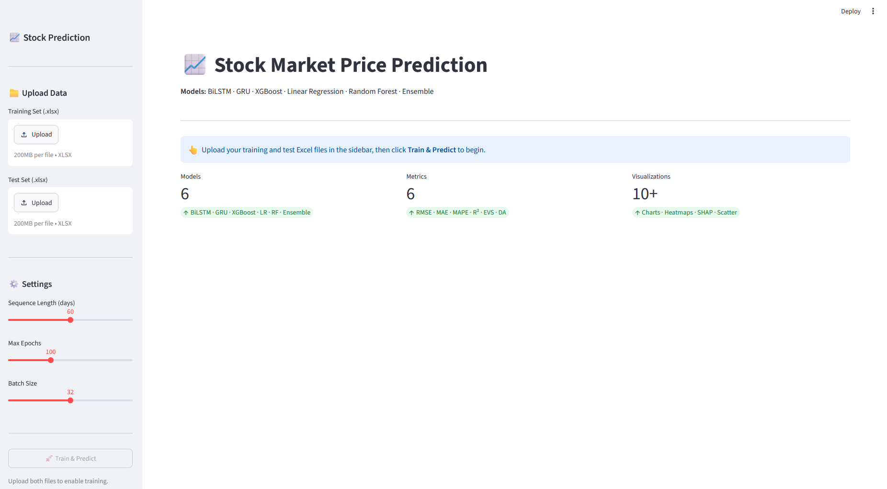

### After Training
Once training completes, KPI cards instantly surface the best-performing model per metric.

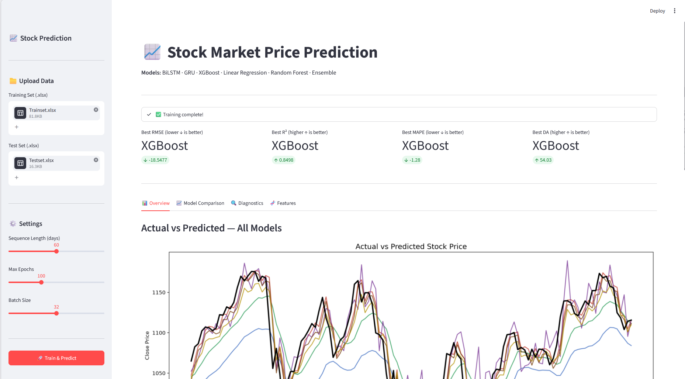

---

## 📑 Dashboard Tabs

### 🏠 Landing
**App Landing Page**
Initial state before data upload — model selector, upload panel, and training controls.
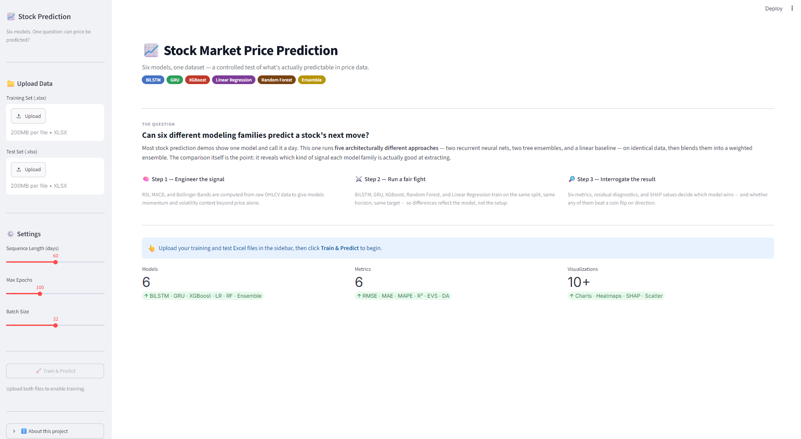

**Post-Training Overview**
Dashboard state immediately after Train & Predict completes.


---

### 1️⃣ The Story
**Actual vs Predicted — All Models**
A single chart overlays every model's predictions against the real closing price, making it easy to visually compare tracking accuracy.
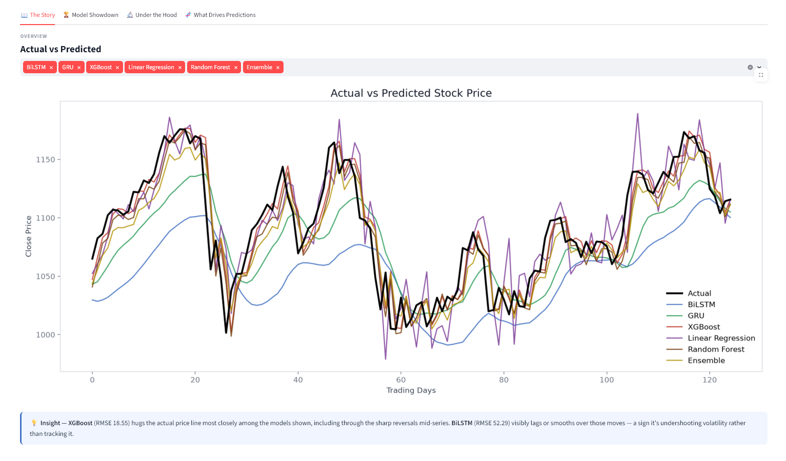

**Regression Metrics & Ensemble Weights**
Metrics table (RMSE, MAE, MAPE, R², EVS, DA) with the best value per column highlighted, alongside the inverse-MAE ensemble weighting breakdown.
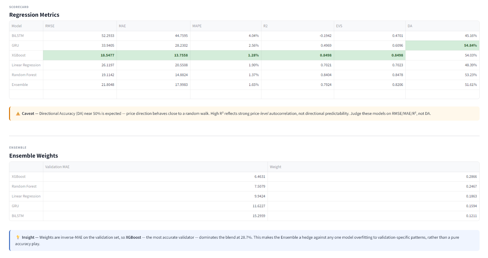

---

### 2️⃣ Model Showdown
**Metric Comparison — All Models**
Six side-by-side bar charts (RMSE, MAE, MAPE, R², EVS, Directional Accuracy) for at-a-glance model ranking.
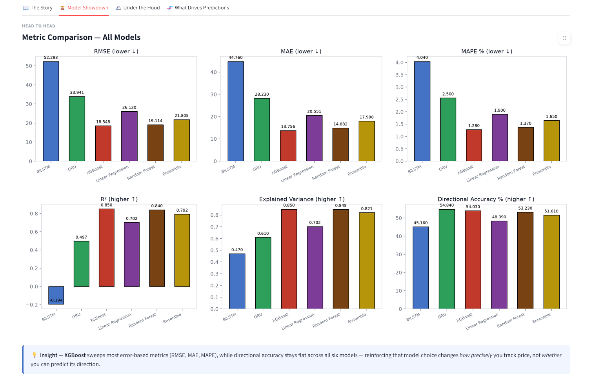

**Predicted vs Actual Scatter Plots**
Each model gets its own scatter plot against the perfect-prediction diagonal, with R² annotated directly on the chart.
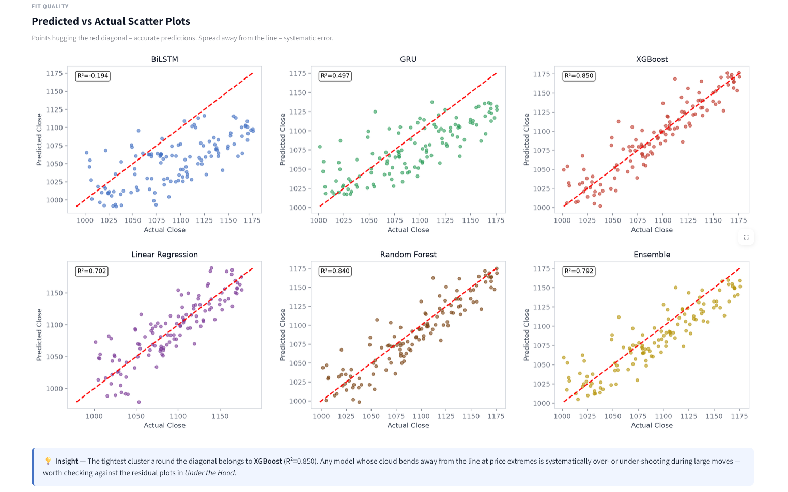

---

### 3️⃣ Under the Hood
**Training & Validation Loss Curves**
Tracks BiLSTM and GRU convergence epoch-by-epoch — useful for spotting overfitting or unstable training.
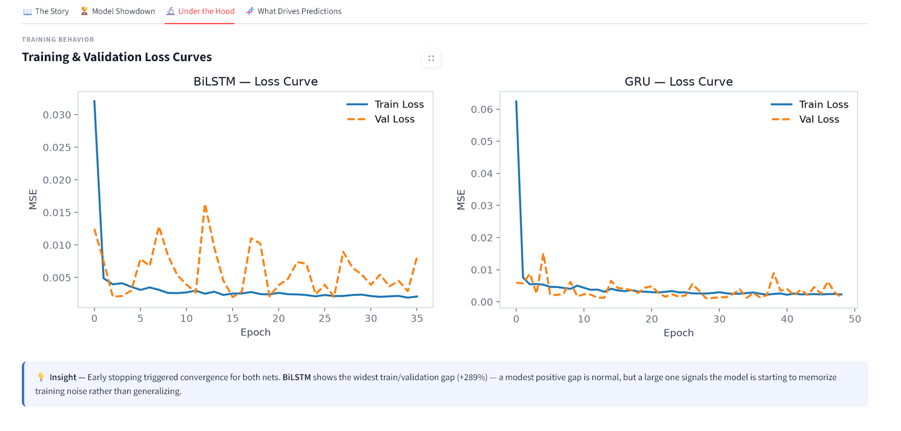

**Residual Distributions**
Histogram of prediction errors per model — a well-centered, narrow distribution around zero indicates a well-calibrated model.
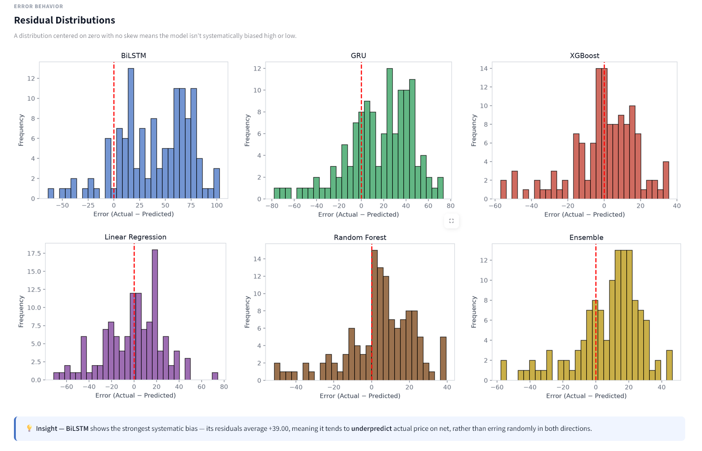

**Residual Scatter Plots**
Residuals plotted against predicted values to check for heteroscedasticity or systematic bias.
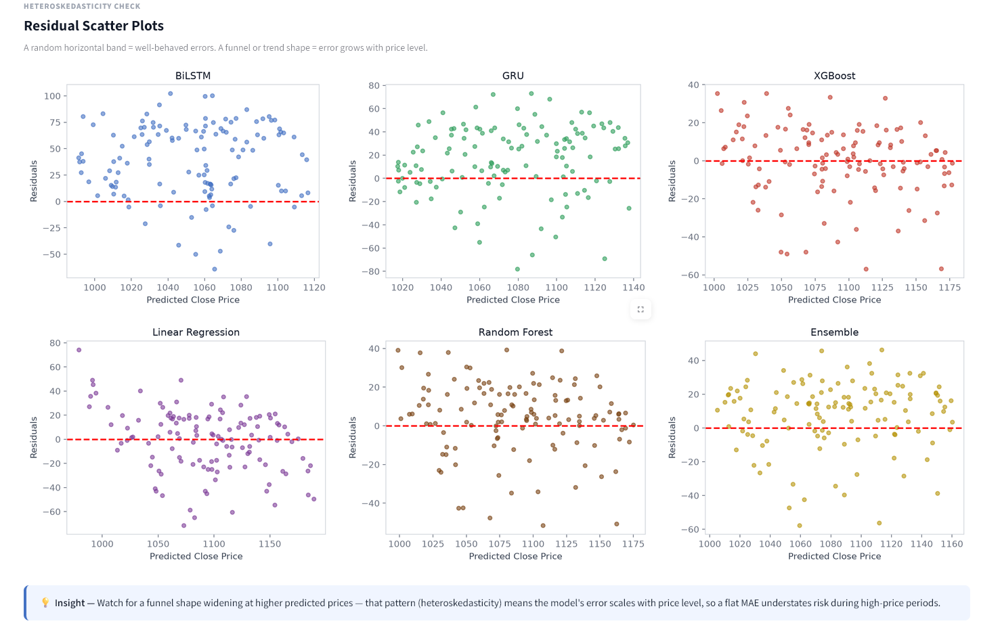

---

### 4️⃣ What Drives Predictions
**Feature Correlation Heatmap**
Full correlation matrix across engineered features — reveals which raw price columns are redundant (Open/High/Low/Close/Adj Close are ~0.99 correlated, Volume anti-correlated). Shown in two halves for readability.
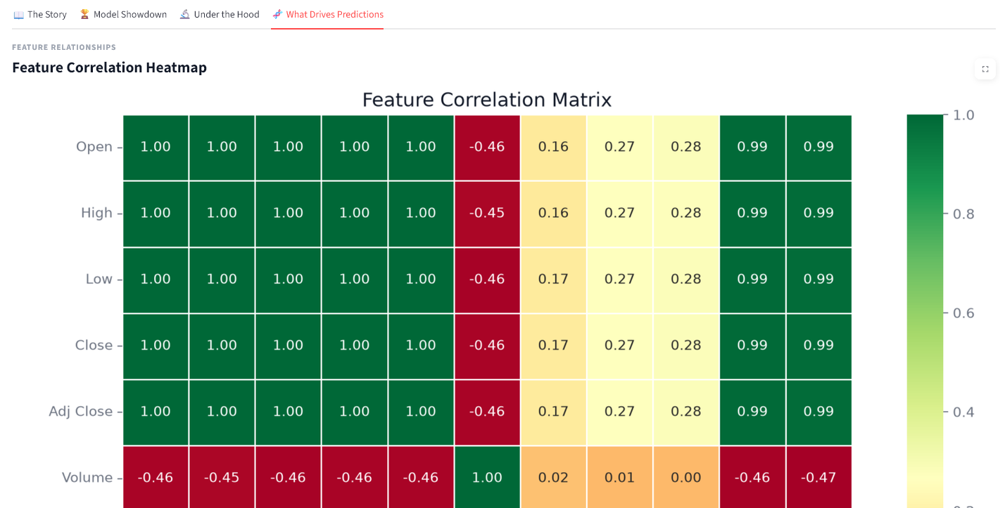
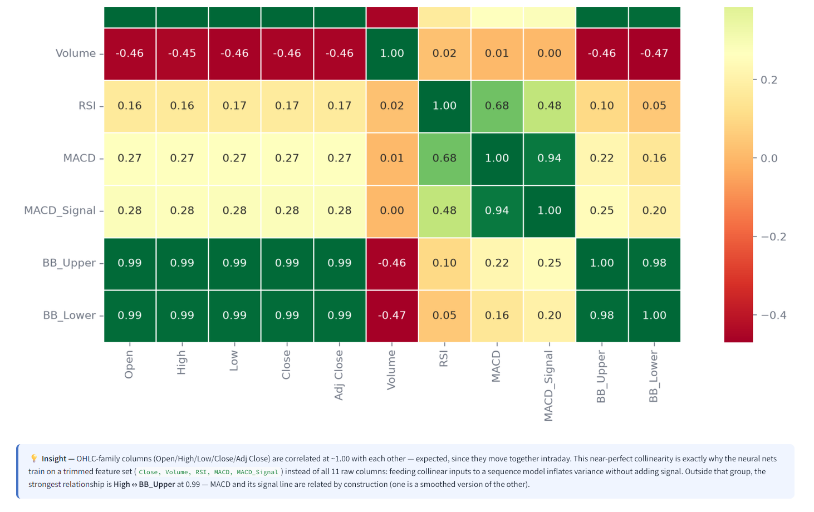

**XGBoost Feature Importance**
Aggregated importance showing which engineered features (RSI, Volume, MACD, etc.) most drive the return-based prediction.
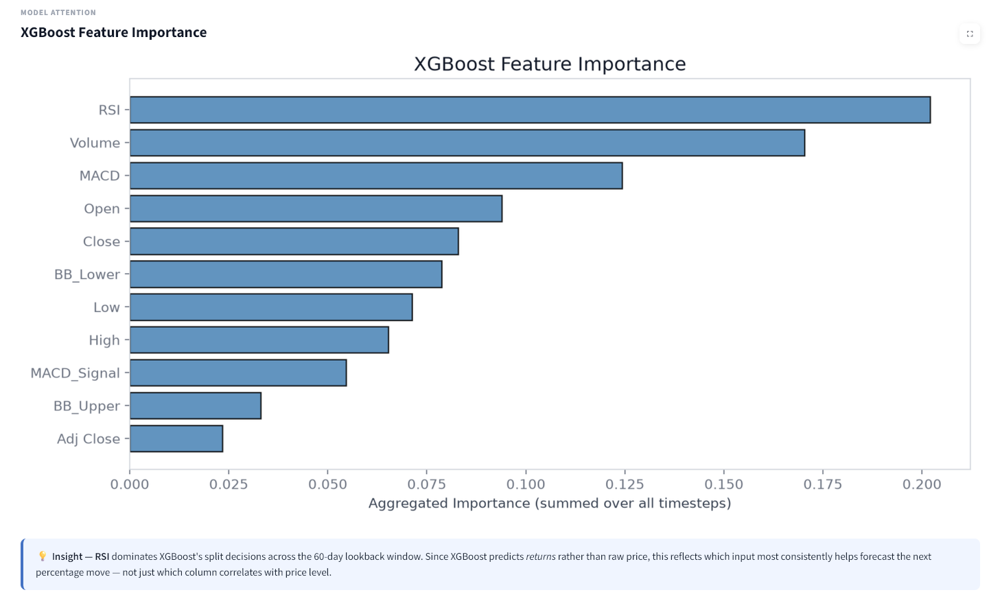

**SHAP Summary Plot**
Top impactful (feature, lag) pairs with readable names like `RSI_t-6`, explaining individual prediction-level feature impact. Shown in two halves for readability.
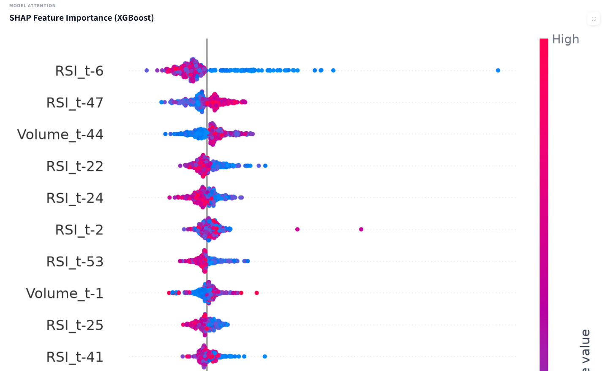
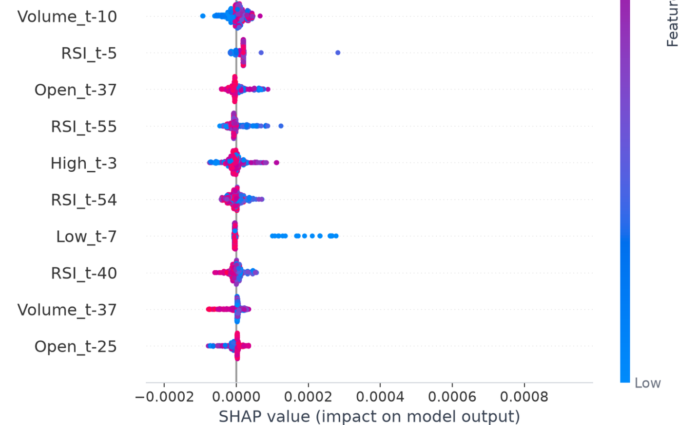

**SHAP Aggregated Feature Importance**
Mean absolute SHAP value per feature, aggregated across all lags.
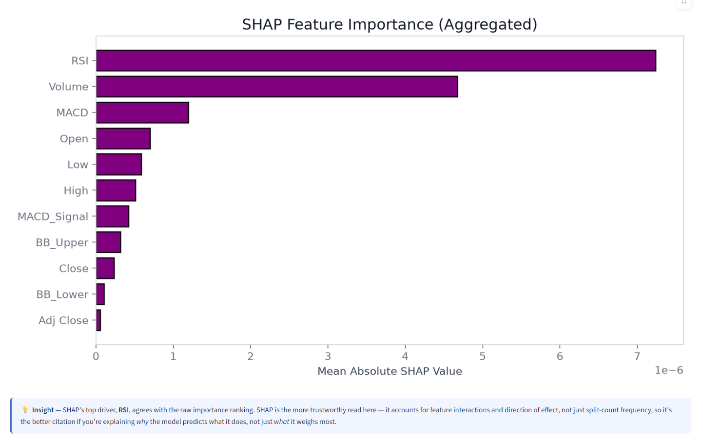

---

## 🗂️ Project Structure

```

Stock-Market-Prediction/
├── app.py                          # Streamlit web application
├── requirements.txt                # Python dependencies
├── README.md
├── LICENSE
├── .gitignore
├── notebook/
│   └── STMPfinalfr.ipynb          # Main analysis notebook (Colab-ready)
├── data/
│   ├── Trainset.xlsx              # Training data
│   └── Testset.xlsx               # Test data
└── screenshots/
    ├── 0_landingpg.png             # App landing page
    ├── 1_after_train.png           # Post-training overview
    ├── 2_story.png                 # Actual vs Predicted
    ├── 3_story.png                 # Regression metrics & ensemble weights
    ├── 4_modelshowdown.png         # Metric comparison bars
    ├── 5_modelshowdown.png         # Scatter plots
    ├── 6_underhood.png             # Loss curves
    ├── 7_underhood.png             # Residual distributions
    ├── 8_underhood.png             # Residual scatter plots
    ├── 9_driveprediction.png       # Correlation heatmap (1/2)
    ├── 10_driveprediction.png      # Correlation heatmap (2/2)
    ├── 11_driveprediction.png      # XGBoost feature importance
    ├── 12_driveprediction.png      # SHAP summary (1/2)
    ├── 13_driveprediction.png      # SHAP summary (2/2)
    └── 14_driveprediction.png      # SHAP feature importance

```

---

## 🚀 How to Run

### Option A — Notebook (Google Colab)
1. Open `notebook/STMPfinalfr.ipynb` in Google Colab
2. Upload `data/Trainset.xlsx` and `data/Testset.xlsx` when prompted
3. Run all cells in order

### Option B — Streamlit App (Local)

```bash
# Clone the repository
git clone https://github.com/Amlan-Sarkar/Stock-Market-Prediction.git
cd Stock-Market-Prediction

# Create and activate a virtual environment
python -m venv .venv
.venv\Scripts\activate        # Windows
source .venv/bin/activate     # Mac/Linux

# Install dependencies
pip install -r requirements.txt

# Run the app
streamlit run app.py
```

Then open `http://localhost:8501` in your browser and upload the Excel files from `data/`.

---

## 📦 Dependencies

All dependencies are listed in `requirements.txt`:

```bash
pip install -r requirements.txt
```

Core libraries: `tensorflow`, `xgboost`, `scikit-learn`, `shap`, `streamlit`, `pandas`, `numpy`, `matplotlib`, `seaborn`, `openpyxl`

---

## 🔍 Key Findings

- **Tree-based models (XGBoost, Random Forest) consistently outperform deep learning models** (BiLSTM, GRU) on this dataset — a well-documented pattern in quantitative finance literature when working with moderate-sized, well-engineered tabular time series data.
- **Directional Accuracy (~50-56%) is near the random-walk baseline** across all models, while price-level R² is strong (up to 0.85). This indicates the models are good at predicting *where* the price will be, but not *which direction* it will move — consistent with weak-form market efficiency.
- **BiLSTM showed high run-to-run variance** (R² ranging from -0.56 to 0.24 across different random seeds), suggesting it requires more training data or architectural tuning to converge reliably on this dataset size.
- **Predicting % returns instead of absolute price levels was essential for tree models** — XGBoost/Random Forest cannot extrapolate beyond the price range seen during training, so training them on bounded return targets (and reconstructing price from the previous close) avoided a flat-line prediction failure mode.

---

## 🛠️ Future Improvements

- Time-series-aware cross-validation (`TimeSeriesSplit`) instead of a single train/validation split
- Hyperparameter tuning via `GridSearchCV` / `RandomizedSearchCV` (XGBoost, Random Forest) and `KerasTuner` (neural networks)
- Additional technical indicators (Stochastic Oscillator, ATR, OBV)
- Multi-step-ahead forecasting instead of single-day-ahead prediction
- Attention-based architectures (Transformer-style) for the sequential models

---

## 📄 License

This project is licensed under the MIT License — see [LICENSE](LICENSE) for details.
