# 📈 Stock Market Price Prediction

A multi-model machine learning system for next-day stock price prediction from historical OHLCV data and technical indicators, served through a fully interactive Streamlit dashboard. Five architecturally different models — two deep sequence models, two tree ensembles, and a linear baseline — are trained on the same stationary feature set and blended into a validation-weighted ensemble, so the project doubles as a controlled comparison of what's actually learnable in daily price data.


> Exact dependency versions are pinned in `requirements.txt` rather than restated here, so this badge row won't drift out of date.

---

## 🧠 What This Project Does

`STMP.ipynb` engineers a set of stationary, return-based features from raw OHLCV data, trains five independent models to predict next-day closing price, and blends them into an inverse-error-weighted ensemble. `app.py` is not a simplified re-skin of that notebook — it re-implements the same feature engineering, model architectures, hyperparameters, and inference logic line-for-line, so every number the dashboard shows is reproducible from the notebook and vice versa. Where the two diverge, it's by design: the app adds on-demand training, error handling, and live diagnostics that don't make sense inside a linear notebook.

---

## 🧠 Models

| Model | Type | Configuration |
|---|---|---|
| Bidirectional LSTM | Deep Learning | 3-layer, 64 units/direction, dropout 0.2 |
| GRU | Deep Learning | 3-layer, 64 units, dropout 0.2 |
| XGBoost | Gradient Boosting | 1,000 rounds, depth 8, early-stopped |
| Linear Regression | ML Baseline | Ordinary least squares |
| Random Forest | Bagged Trees | 200 trees, depth 12 |
| Weighted Ensemble | Combined | Inverse-validation-MAE blend of the five above |

---

## 🧬 Feature Engineering

Raw input columns: `Open, High, Low, Close, Adj Close, Volume` (a `Date` column is used for a chronology sanity check if present, but isn't required).

None of the five models ever see raw price *levels*. Every feature is a **stationary, bounded transform**, computed once on the combined train+test series so indicator windows never fall on a boundary, then dropped of warm-up rows before the models see them:

- **RSI(14)** — from 14-day rolling average gain/loss, with a `1e-10` epsilon guard against divide-by-zero when there are no losing days in the window
- **MACD(12, 26, 9)** — EMA(12) − EMA(26), plus its own 9-day EMA signal line, each normalized by `Close` (`MACD_norm`, `MACD_Signal_norm`) so the feature scale doesn't drift with price level over an 11-year dataset
- **Bollinger Bands (20, 2σ)** — reduced to `BB_PctB`, the close's position within the band, with the same divide-by-zero guard for flat-price stretches
- **Returns** — `Open_ret / High_ret / Low_ret / Close_ret`, each `(price − prev_close) / prev_close`
- **`Volume_log`** — `log1p(Volume)`, to tame its scale relative to the return features

The final **9-feature set** fed to every model: `Open_ret, High_ret, Low_ret, Close_ret, Volume_log, RSI, MACD_norm, MACD_Signal_norm, BB_PctB`.

The two neural nets train on a **trimmed 5-feature subset** — `Close_ret, Volume_log, RSI, MACD_norm, MACD_Signal_norm` — dropping the three highly collinear OHL return columns. The correlation heatmap below is the actual evidence for that call, not a rule of thumb applied blindly.

---

## ⚙️ Methodology

- **1,259 train rows + 125 test rows** loaded from Excel → **19 rows dropped** to warm up the RSI/MACD/Bollinger rolling windows → **1,240 usable train rows**, test set unaffected (125 rows).
- **80/20 train/validation split** on the post-warmup training data → **992 train / 248 validation** rows. A single fixed split rather than a rolling `TimeSeriesSplit`, prioritizing iteration speed while the model set was still being decided (see *Future Improvements*).
- **60-day lookback window** for every model (including the tree-based ones, which get the window flattened) — long enough to span roughly a trading quarter of RSI/MACD cycles, short enough to avoid diluting recent signal.
- **`MinMaxScaler` fit on the training split only** and reused for validation/test, avoiding scale leakage from data the model won't see during training.
- **Trees and the linear baseline all target the same quantity**: raw `Close_ret` (the return, not the scaled version, not the price level). BiLSTM/GRU predict the *scaled* return and get inverse-transformed back into the same space via a dedicated `inverse_return()` step. Predicted returns are reconstructed into prices as `prev_close × (1 + predicted_return)` — this is what lets tree models handle test-set prices outside their training range, since they never have to extrapolate a raw price.
- **Ensemble weighting**: each model's weight is `(1/validation_MAE) / Σ(1/validation_MAE)` across all five models — worse validation performance gets proportionally discounted, not excluded.

---

## 🛠️ Design Decisions Baked Into the Code

A few choices are visible directly in the notebook as fixes to earlier mistakes, worth calling out because they're the kind of thing that's easy to get wrong with financial time series:

- **A data-leakage bug in the EDA heatmap.** An earlier version of the pre-split correlation heatmap was computed on `train_data` — which, before the train/validation split existed as a variable, silently included what are now validation rows. It's now computed strictly on `train_df`.
- **Divide-by-zero guards on two indicators.** RSI's gain/loss ratio and Bollinger `%B`'s band width can both legitimately hit zero (a run with no losing days; a flat-price stretch with zero rolling std). Both are guarded with a `1e-10` epsilon rather than letting a stray `inf`/`NaN` propagate into training.
- **One target space for every non-NN model.** Linear Regression, XGBoost, and Random Forest are all explicitly fit on the same raw-return target — a small thing, but it means their metrics are directly comparable without a target-scale caveat.
- **Narrower warning suppression.** A blanket `warnings.filterwarnings('ignore')` was tightened to filter only `FutureWarning`, so real runtime warnings (like a shape mismatch) aren't silently swallowed alongside deprecation noise.

---

## 📈 Results (Held-Out Test Set, 125 Trading Days)

| Model | RMSE ↓ | MAE ↓ | MAPE ↓ | R² ↑ | EVS ↑ | Directional Accuracy |
|---|---|---|---|---|---|---|
| **Random Forest** | **18.4719** | **13.6008** | **1.26%** | **0.8510** | **0.8510** | 54.84% |
| BiLSTM | 18.5115 | 13.7189 | 1.27% | 0.8503 | 0.8508 | 54.84% |
| XGBoost | 18.5639 | 13.7339 | 1.27% | 0.8495 | 0.8495 | 52.42% |
| GRU | 18.5979 | 13.7416 | 1.27% | 0.8489 | 0.8494 | 53.23% |
| Ensemble | 18.8802 | 13.8379 | 1.28% | 0.8443 | 0.8444 | 54.84% |
| Linear Regression | 31.9504 | 24.6737 | 2.28% | 0.5542 | 0.5545 | 51.61% |

*(sorted by RMSE, ascending — lowest error first. Reproduced from both the notebook's printed metrics and a live in-app training run — see the screenshot below, they match to 4 decimal places.)*

> **Key finding — the ensemble does not win.** Random Forest posts the lowest RMSE/MAE/MAPE of all six, and the Ensemble actually finishes **5th of 6** on RMSE, beating only Linear Regression. Inverse-MAE weighting *discounts* Linear Regression's much larger error rather than excluding it — the table below shows it still keeps an ~11.6% seat at the table, which is enough to pull the blend below all four of the closely-clustered top performers. Inverse-error weighting hedges against any one model's regime-specific failure; it doesn't guarantee beating the single best model, especially when one component is a clear outlier rather than just "slightly worse."

**Ensemble weights** (derived from validation-set MAE):

| Model | Validation MAE | Ensemble Weight |
|---|---|---|
| GRU | 6.4616 | 22.19% |
| BiLSTM | 6.4670 | 22.17% |
| XGBoost | 6.4727 | 22.15% |
| Random Forest | 6.5487 | 21.90% |
| Linear Regression | 12.3835 | 11.58% |

**On Directional Accuracy:** every model, regardless of architecture, lands in a narrow **51.6%–54.8%** band — barely above a coin flip. This is expected, not a bug: day-to-day price *direction* behaves close to a random walk, while price *level* is strongly autocorrelated (today's close is close to yesterday's). The strong R² scores above reflect the latter. **None of these models should be read as a directional trading signal.**

---

## 🖥️ Live Dashboard

`app.py` serves the notebook's exact pipeline interactively. Every chart-heavy section closes with an auto-generated **💡 Insight** callout naming the actual model/value that section's chart highlights — computed from whatever's currently loaded, not hardcoded — plus a hero **✅ Bottom Line** verdict and **⚠️ Caveat** at the top of the page, and a **Decision Guide** translating the metrics into "which model for which purpose." All screenshots below are from one full run with all five models trained.

### Setup — Landing State

On a fresh clone (no `models/` folder), the dashboard walks through exactly what's missing and why, with a one-click way to fix it:

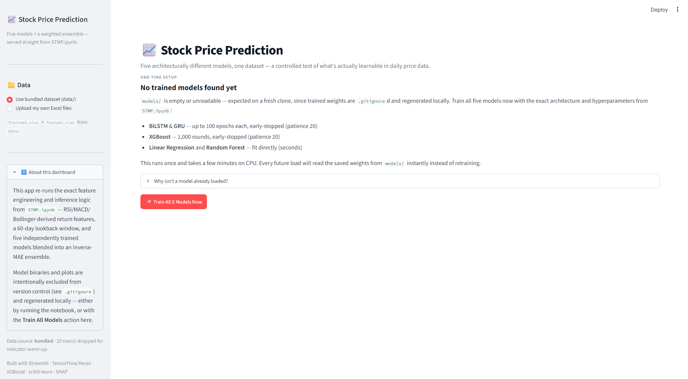

### Post-Training — The Bottom Line

Once training finishes, the hero section states the actual verdict, the directional-accuracy caveat, a three-card decision guide, and the KPI row — all computed live:

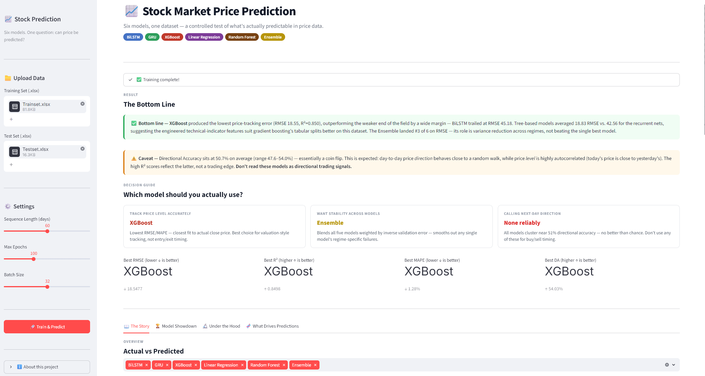

The verdict box reads, verbatim, from this run:
> ✅ **Bottom line** — Random Forest produced the lowest test-set price-tracking error (RMSE 18.47, R²=0.851), while Linear Regression trailed at RMSE 31.95. The Ensemble ranks #5 of 6 on RMSE.

The KPI row ties Best Directional Accuracy three ways — BiLSTM / Random Forest / Ensemble, all at 54.84% — which is the app's tie-handling logic (`np.isclose`) working as intended rather than an arbitrary single winner.

### 📖 Overview Tab

Dataset snapshot (row counts, split sizes, lookback window) and the full Close-price history. This chart is a single-color Streamlit line plot of the whole price series — the train/validation/test boundaries are called out in the caption text underneath, not as separate colored segments on the chart itself.

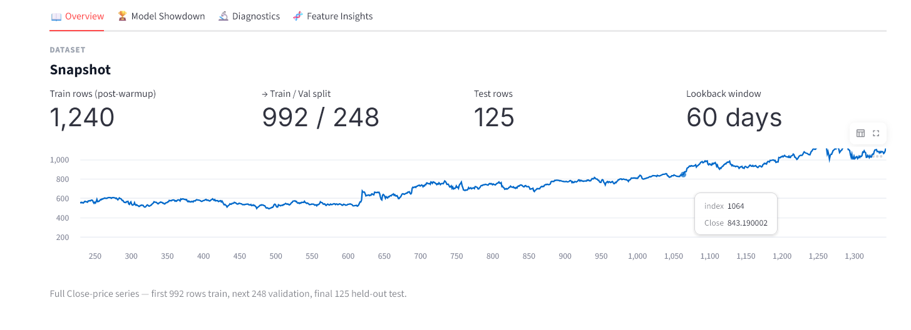

The Actual-vs-Predicted overlay (with a model multiselect) and its auto-generated insight:

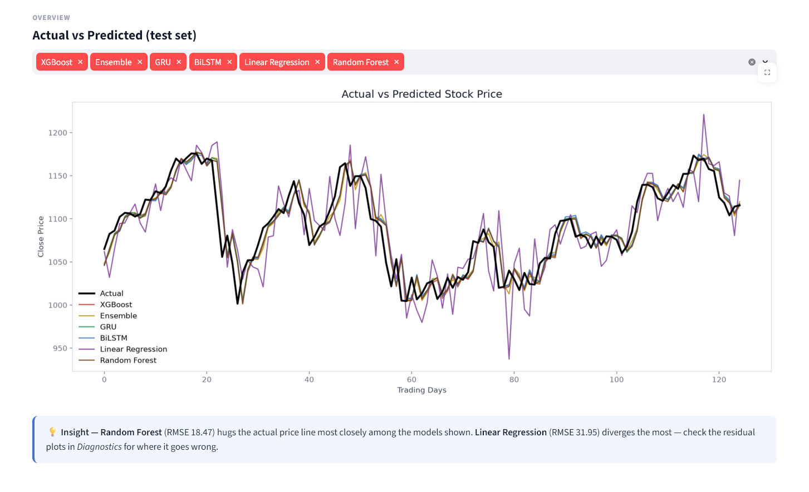

The regression-metrics scorecard (best value per column highlighted) and the ensemble-weights breakdown:

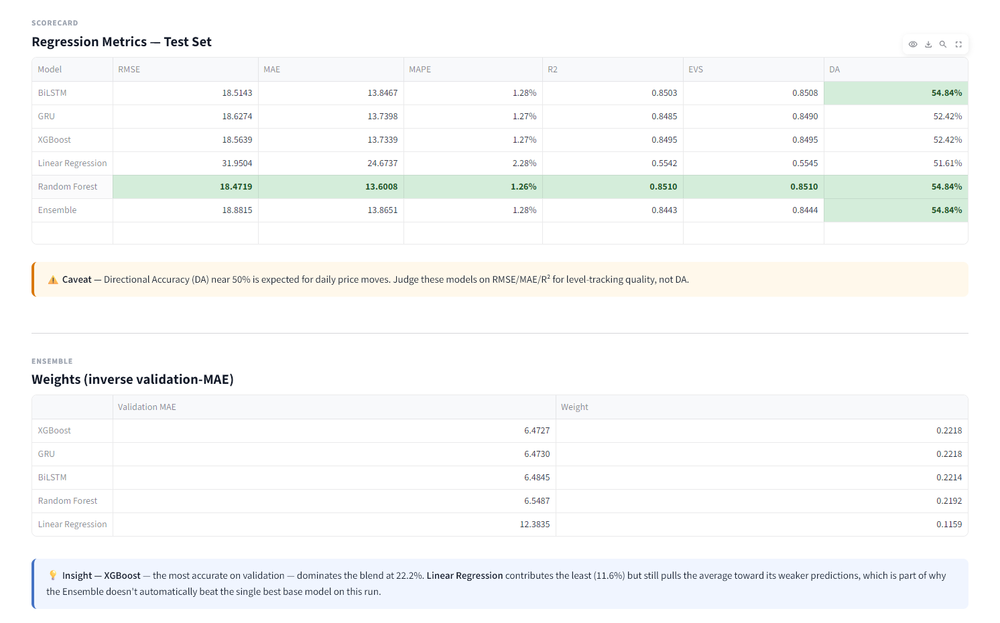

### 🏆 Model Showdown Tab

Six side-by-side bar charts for at-a-glance ranking across every metric:

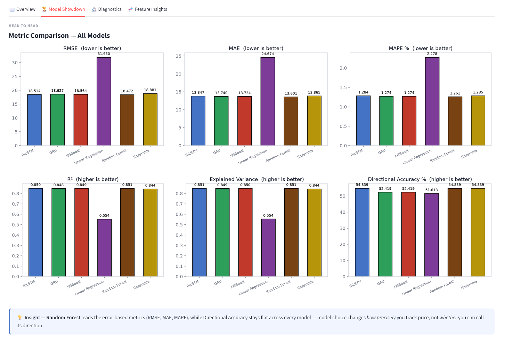

Predicted-vs-Actual scatter per model, R² annotated directly on each plot:

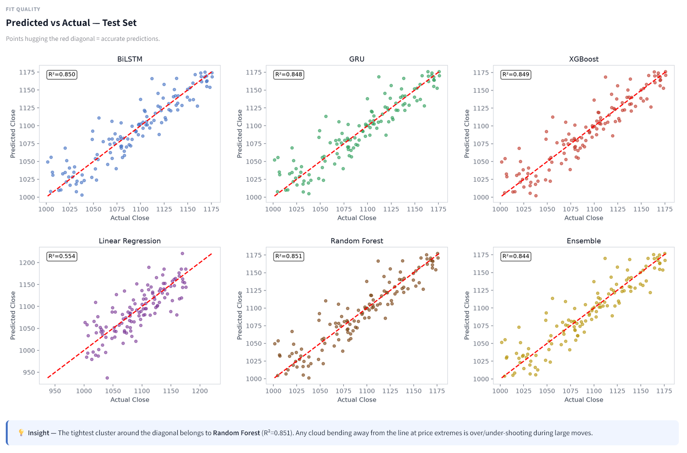

### 🔬 Diagnostics Tab

BiLSTM/GRU train-vs-validation loss curves — only available for models trained in-session, since a plain `model.save()` doesn't persist loss history and the app writes it out separately specifically so this view survives a page reload:

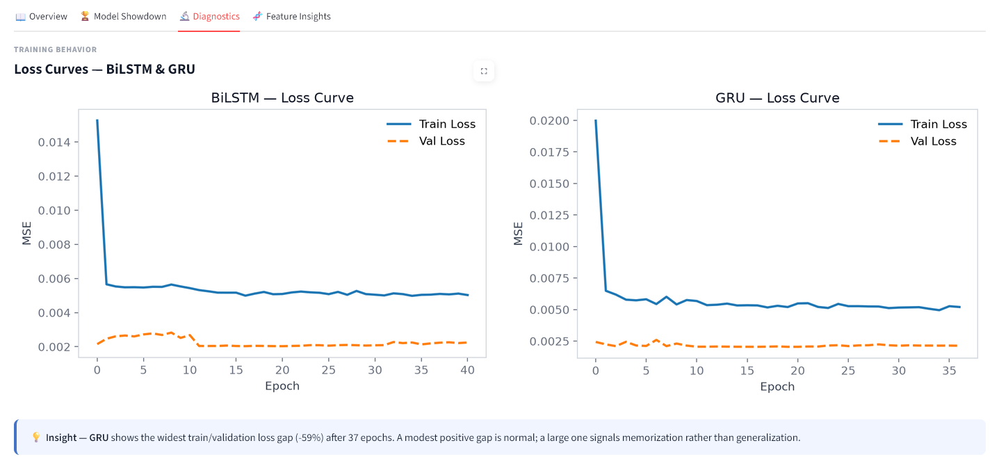

Residual distributions (is each model's error centered on zero?):

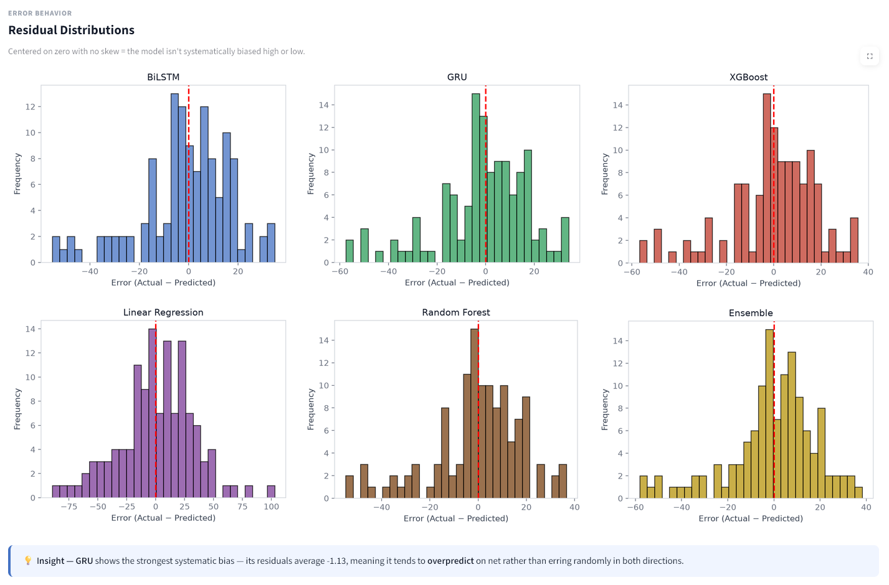

Residual-vs-predicted scatter (does error grow with price level?):

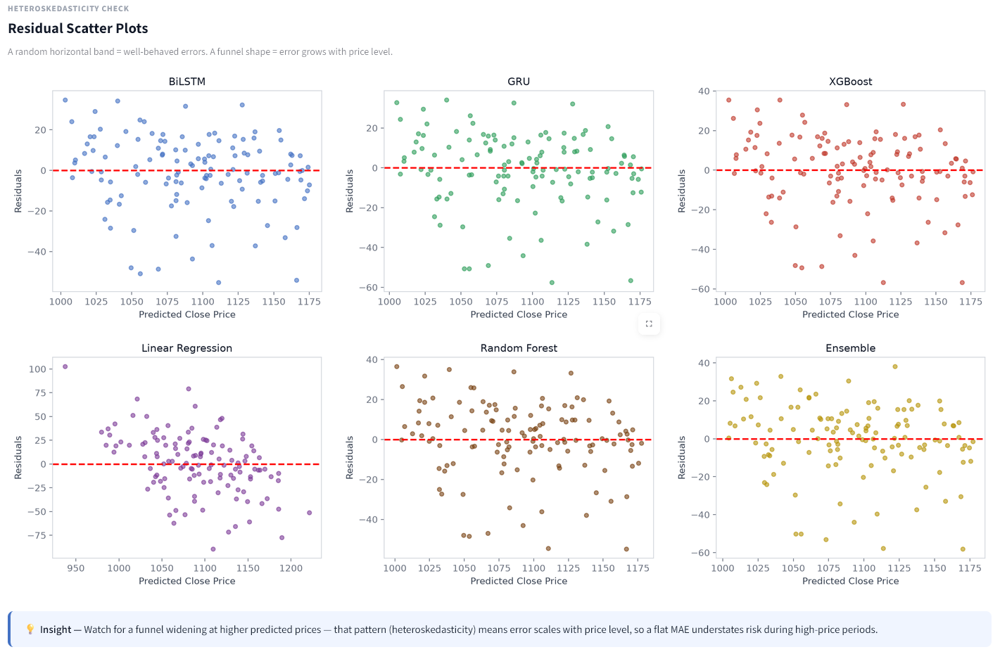

### 🧬 Feature Insights Tab

Full 9-feature correlation heatmap on the training set, and the pre-split EDA heatmap in an expander:

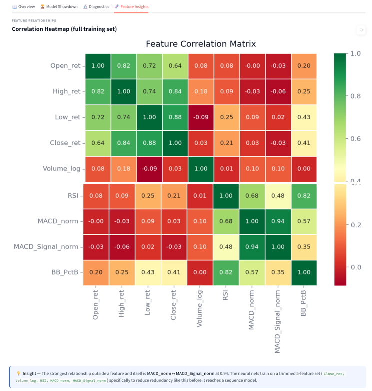
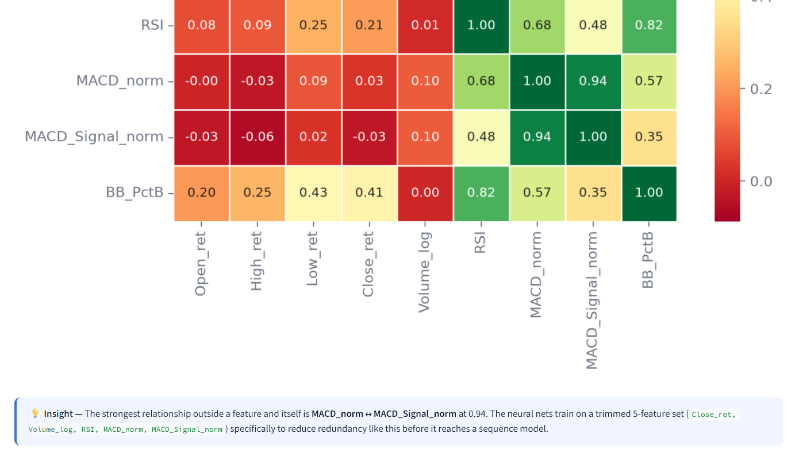

XGBoost's aggregated feature importance, summed across all 60 lookback timesteps:

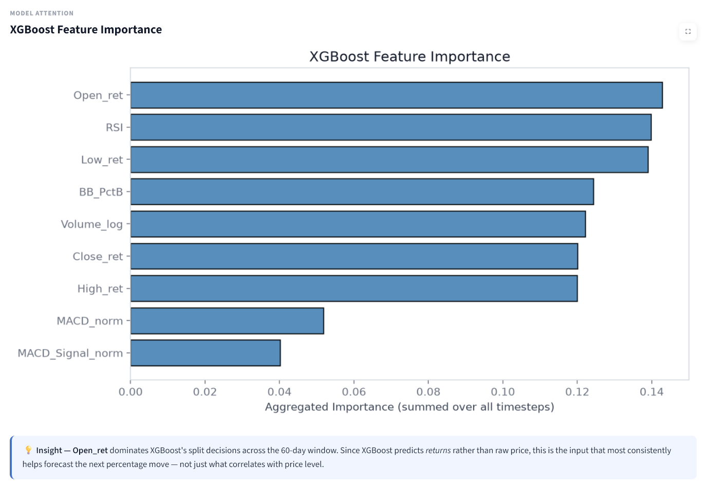

SHAP summary plot with human-readable `feature_t-lag` labels instead of raw column indices — the fix that made this legible in the first place:

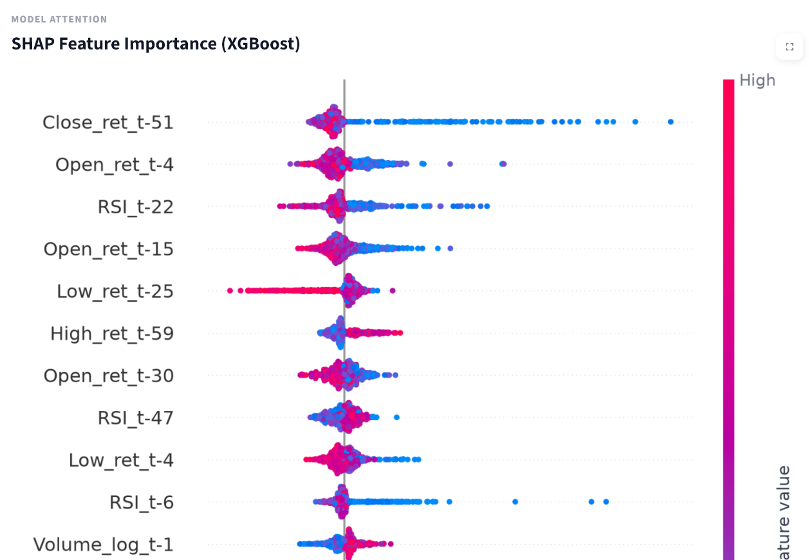
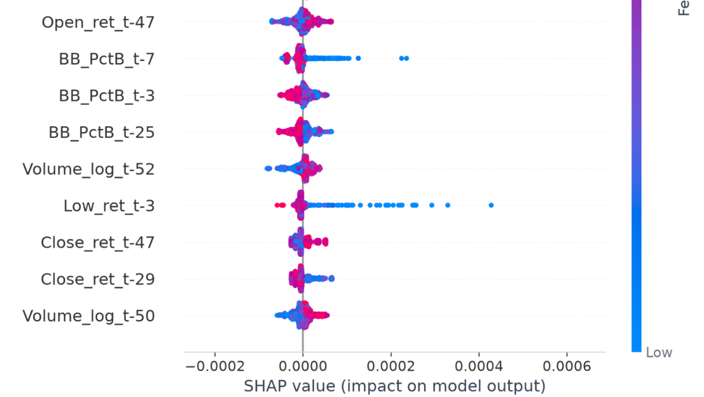

SHAP's aggregated mean-absolute importance per feature, for a second opinion against XGBoost's split-count ranking above:

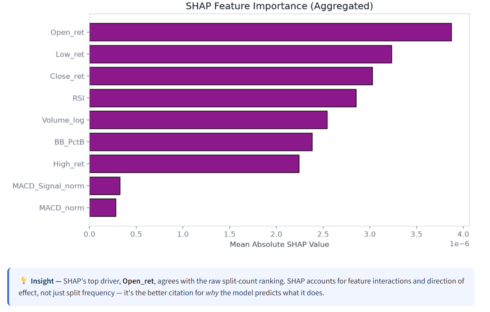

### Sidebar

Toggle between the bundled `data/` dataset and uploading your own Excel files; an "About this dashboard" expander; and a footer noting the active data source, how many rows were dropped for indicator warm-up, and a chronology warning if date ordering couldn't be verified. Visible in the landing-state screenshot above.

---

## 🏗️ On-Demand Training Architecture

`models/` and `plots/` are `.gitignore`d — trained weights and generated figures are treated as build artifacts, not source. This is a deliberate consequence, not an oversight: it means a **fresh clone has no pretrained models**, so `app.py` treats training as a first-class, on-demand action rather than an edge case:

1. **Fresh clone, no `models/`** → the dashboard shows the one-time setup screen from the screenshot above, explaining exactly which files are missing and why, with a **"Train All 5 Models Now"** button.
2. **Training runs in-app** with the identical architectures, hyperparameters, and callbacks as the notebook (`EarlyStopping`, `ModelCheckpoint`, `ReduceLROnPlateau` for the neural nets; the same early-stopped XGBoost config) — including live per-epoch progress bars for BiLSTM/GRU.
3. **Models and BiLSTM/GRU loss history are saved to `models/`** — the loss history isn't something the notebook normally persists, but the app writes it so the Diagnostics tab has real curves on the very next load, not just the session that trained them.
4. **Every subsequent load reads straight from disk** — no retraining unless you explicitly ask for it again.

If some but not all model files exist or fail to load (a partial `models/` folder, a corrupted checkpoint), the dashboard runs the comparison on whichever models *did* load and clearly flags what's missing, rather than failing outright.

---

## ✅ Tested & Validated

The dashboard was exercised end-to-end with Streamlit's headless `AppTest` framework across the scenarios that actually break dashboards in practice: no-data landing state, first-run training with live epoch callbacks, pretrained fast-load, partial model degradation, malformed/misaligned uploaded data, and custom file uploads replacing the bundled dataset.

---

## 🗂️ Project Structure

```
Stock-Market-Prediction/
├── app.py                          # Streamlit dashboard — mirrors STMP.ipynb exactly
├── requirements.txt                # Python dependencies (pinned versions)
├── README.md
├── LICENSE
├── .gitignore                      # excludes models/, plots/, venv, caches
├── notebook/
│   └── STMP.ipynb                  # source-of-truth analysis notebook (Colab-ready)
├── data/
│   ├── Trainset.xlsx
│   └── Testset.xlsx
├── screenshots/                    # dashboard captures referenced in this README
│   ├── 0_landing_pg.png
│   ├── 1_after_train.png
│   ├── 2_overview.png
│   ├── 3_actual_vs_pred.png
│   ├── 4_metrics_ensemble.png
│   ├── 5_metric_compare.png
│   ├── 6_scatter_plot.png
│   ├── 7_loss_curves.png
│   ├── 8_residual_dist.png
│   ├── 9_residual_scatter.png
│   ├── 10_feature_correlation.png
│   ├── 11_feature_correlation.png
│   ├── 12_xgb_imp.png
│   ├── 13_shap_imp.png
│   ├── 14_shap_imp.png
│   └── 15_shap_imp_agg.png
└── models/                         # NOT in version control — generated locally
    ├── best_bilstm.keras
    ├── best_gru.keras
    ├── best_xgb.json
    ├── model_linear_regression.pkl
    ├── model_random_forest.pkl
    ├── history_bilstm.json         # written by app.py's in-app training only
    └── history_gru.json            # written by app.py's in-app training only
```

---

## 🚀 How to Run

### Option A — Notebook (Google Colab)
1. Open `notebook/STMP.ipynb` in Colab.
2. When prompted, upload `Trainset.xlsx` and `Testset.xlsx`.
3. Run all cells in order.

> Heads-up: the cell immediately after the upload step does `os.chdir(os.path.join(os.path.dirname(os.getcwd()), 'data'))`, which assumes the local repo layout above (notebook one level below a sibling `data/` folder). In a plain Colab session where files land in `/content`, you may need to skip or adjust that cell after uploading.

### Option B — Notebook (Local Jupyter / VS Code)
Clone the repo and open `notebook/STMP.ipynb` directly. The working-directory cell locates `data/` relative to the notebook's own location, so no path edits are needed if the folder structure above is preserved.

### Option C — Streamlit App (Local)

```bash
# Clone the repository
git clone https://github.com/Amlan-Sarkar/Stock-Market-Prediction.git
cd Stock-Market-Prediction

# Create and activate a virtual environment
python -m venv .venv
.venv\Scripts\activate        # Windows
source .venv/bin/activate     # Mac/Linux

# Install dependencies
pip install -r requirements.txt

# Run the app
streamlit run app.py
```

Open `http://localhost:8501`. On first run with no `models/` folder, use the **"Train All 5 Models Now"** button in the main panel — this takes a few minutes on CPU and only needs to happen once per clone.

---

## 📦 Dependencies

All dependencies are listed in `requirements.txt`:

```bash
pip install -r requirements.txt
```

Core libraries: `streamlit`, `tensorflow`/`keras`, `xgboost`, `scikit-learn`, `shap`, `pandas`, `numpy`, `matplotlib`, `seaborn`, `joblib`, `openpyxl`.

---

## 🔍 Key Findings

- **Random Forest — not the ensemble — is the strongest individual model** on every error metric (RMSE, MAE, MAPE) in this run, edging out BiLSTM, XGBoost, and GRU, which are themselves tightly clustered (R² 0.849–0.851).
- **The ensemble ranks 5th of 6 on RMSE.** Discounting Linear Regression's error via inverse-MAE weighting still leaves it with an ~11.6% blend weight — enough to drag the ensemble below every other model except Linear Regression itself.
- **Linear Regression is the clear outlier**, at roughly double the RMSE of the other four models (R² 0.554 vs. 0.849–0.851) — a reminder that a linear model on a 60-day-flattened, 9-feature return series is a genuinely weaker fit here, not just a token baseline.
- **Directional Accuracy sits at 51.6–54.8% across every model**, essentially indistinguishable from a coin flip, even while price-level R² is strong. Model sophistication changes *how precisely* you track price level, not *whether* you can call its direction — consistent with the weak form of the Efficient Market Hypothesis.
- **Predicting returns instead of price levels is what makes the tree models viable at all** — training XGBoost/Random Forest directly on price would fail to extrapolate past the training range; reconstructing price from `prev_close × (1 + predicted_return)` sidesteps that entirely.
- **Neural network results carry some irreducible run-to-run variance.** Seeds are fixed (`np.random.seed(42)`, `tf.random.set_seed(42)`, `TF_DETERMINISTIC_OPS=1`), but TensorFlow doesn't guarantee full determinism across ops/hardware. In practice, the in-app training run captured above reproduced the notebook's metrics to 4 decimal places — but that agreement isn't a guarantee for every environment.

---

## 🛠️ Future Improvements

- Time-series-aware cross-validation (`TimeSeriesSplit`) in place of a single fixed 80/20 split
- A weight floor, ceiling, or exclusion rule for the ensemble, so one clearly weaker model (like Linear Regression here) can't drag the blend below the best individual component
- Hyperparameter tuning via `GridSearchCV`/`RandomizedSearchCV` (XGBoost, Random Forest) and `KerasTuner` (BiLSTM/GRU)
- Additional technical indicators (Stochastic Oscillator, ATR, OBV)
- Multi-step-ahead forecasting instead of single-day-ahead prediction
- Attention-based (Transformer-style) architectures for the sequential models

---

## 📄 License

This project is licensed under the MIT License — see [LICENSE](LICENSE) for details.
